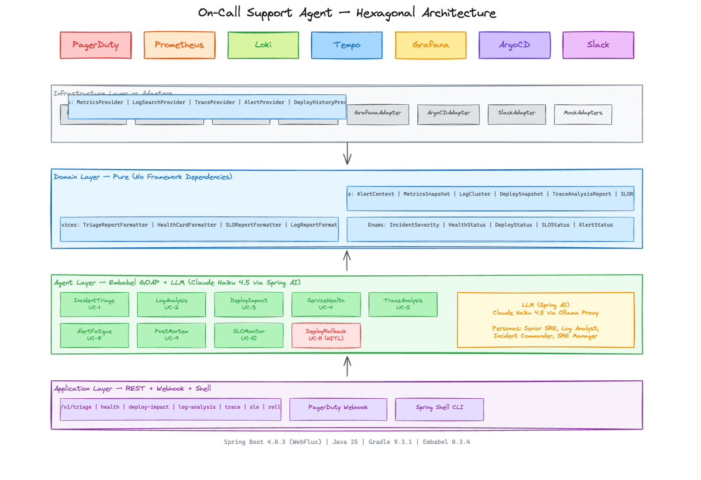

# On-Call Support Agent

AI-powered GOAP agent that automates incident triage, root cause analysis, and guided remediation across an enterprise Java/Spring stack. Integrates with Prometheus, Loki, Tempo, Grafana, PagerDuty, ArgoCD, and Slack to reduce MTTR and on-call toil.

## Architecture



**Hexagonal architecture** enforced by ArchUnit — domain has zero dependencies on infrastructure, agents, or frameworks.

## Tech Stack

| Layer | Technology |
|-------|-----------|
| Language | Java 25 |
| Framework | Spring Boot 4.0.3 (WebFlux — reactive) |
| AI Agent | Embabel Agent Framework 0.3.4 (GOAP orchestration) |
| LLM | Ollama + llama3.2 (local, free) — swappable to Claude or OpenAI |
| Build | Gradle 9.3.1 (Kotlin DSL) |
| Architecture | Hexagonal (ports & adapters), validated by ArchUnit |
| Code Style | Spotless (auto-formatting) |

## Use Cases

| UC | Agent | Command | REST Endpoint | Persona |
|----|-------|---------|---------------|---------|
| UC-1 | **IncidentTriageAgent** | `triage <alertId>` | `POST /api/v1/triage` | Senior SRE |
| UC-2 | **LogAnalysisAgent** | `logs <service>` | `POST /api/v1/log-analysis` | Log Analyst |
| UC-3 | **DeployImpactAgent** | `deploy-impact <service>` | `POST /api/v1/deploy-impact` | Senior SRE |
| UC-4 | **ServiceHealthAgent** | `health <service>` | `GET /api/v1/health/{service}` | Senior SRE |
| UC-5 | **TraceAnalysisAgent** | `trace <service> [traceId]` | `POST /api/v1/trace-analysis` | Senior SRE |
| UC-8 | **AlertFatigueAgent** | `alert-fatigue <team> <days>` | `GET /api/v1/alert-fatigue` | SRE Manager |
| UC-9 | **PostMortemAgent** | `postmortem <incidentId> [service]` | `POST /api/v1/postmortem` | Incident Commander |
| UC-10 | **SLOMonitorAgent** | `slo <service>` | `GET /api/v1/slo/{service}` | Senior SRE |

Each agent uses the **Embabel GOAP (Goal-Oriented Action Planning)** engine to autonomously plan and execute a sequence of actions — fetching metrics, logs, traces, and deploys — then synthesizes findings via an LLM into a structured report.

## Quick Start

### Prerequisites

- Java 25+
- Docker (for observability stack)
- Ollama (for local LLM)

### 1. Start LLM

```bash
ollama serve
ollama pull llama3.2
```

### 2. Run with Mock Adapters (no external dependencies)

```bash
./gradlew bootRun
```

This starts the Embabel interactive shell with mock data for all external services. Try:

```
embabel> health alert-api
embabel> slo alert-api
embabel> logs alert-api
embabel> triage ALERT-123
```

### 3. Run Against Live Observability Stack

Start the price-alert observability stack (Prometheus, Loki, Tempo, Grafana):

```bash
cd /path/to/price-alert
docker compose up -d
```

Start WireMock mocks for PagerDuty, Slack, and ArgoCD:

```bash
cd docker && docker compose up -d
```

Run the agent with all adapters enabled:

```bash
SPRING_PROFILES_ACTIVE=e2e SERVER_PORT=8090 ./gradlew bootRun
```

### 4. Use the REST API

```bash
# Service health check
curl http://localhost:8090/api/v1/health/alert-api

# SLO burn rate
curl http://localhost:8090/api/v1/slo/alert-api

# Log analysis
curl -X POST http://localhost:8090/api/v1/log-analysis \
  -H "Content-Type: application/json" \
  -d '{"service": "alert-api", "timeWindow": "1h", "severity": "error"}'

# Incident triage
curl -X POST http://localhost:8090/api/v1/triage \
  -H "Content-Type: application/json" \
  -d '{"alertId": "ALERT-123", "service": "alert-api", "severity": "SEV2", "description": "High error rate"}'

# Deploy impact
curl -X POST http://localhost:8090/api/v1/deploy-impact \
  -H "Content-Type: application/json" \
  -d '{"service": "evaluator"}'

# Trace analysis
curl -X POST http://localhost:8090/api/v1/trace-analysis \
  -H "Content-Type: application/json" \
  -d '{"service": "alert-api"}'

# Alert fatigue
curl "http://localhost:8090/api/v1/alert-fatigue?team=platform&days=7"

# Post-mortem draft
curl -X POST http://localhost:8090/api/v1/postmortem \
  -H "Content-Type: application/json" \
  -d '{"incidentId": "INC-456", "service": "alert-api"}'
```

## Project Structure

```
src/main/java/com/stablebridge/oncall/
├── agent/                          # 8 GOAP agents (one per use case)
│   ├── triage/                     # IncidentTriageAgent
│   ├── logs/                       # LogAnalysisAgent
│   ├── deploy/                     # DeployImpactAgent
│   ├── health/                     # ServiceHealthAgent
│   ├── trace/                      # TraceAnalysisAgent
│   ├── fatigue/                    # AlertFatigueAgent
│   ├── postmortem/                 # PostMortemAgent
│   ├── slo/                        # SLOMonitorAgent
│   └── persona/                    # OnCallPersonas (4 personas)
├── domain/                         # Pure domain — no framework deps
│   ├── model/                      # 45 immutable records + 8 enums
│   │   ├── common/                 # Enums, exceptions
│   │   ├── alert/                  # AlertContext, TriageReport, etc.
│   │   ├── metrics/                # MetricsSnapshot, SLOSnapshot, etc.
│   │   ├── logs/                   # LogCluster, LogAnalysisReport
│   │   ├── deploy/                 # DeploySnapshot, DeployImpactReport
│   │   ├── health/                 # ServiceHealthReport, DependencyStatus
│   │   ├── trace/                  # CallChainStep, TraceAnalysisReport
│   │   ├── fatigue/                # AlertFatigueReport, NoisyRule
│   │   ├── postmortem/             # PostMortemDraft, ActionItem
│   │   └── slo/                    # SLOReport, BurnContributor
│   ├── port/                       # 12 port interfaces
│   │   ├── loki/                   # LogSearchProvider
│   │   ├── prometheus/             # MetricsProvider, DependencyGraphProvider
│   │   ├── tempo/                  # TraceProvider
│   │   ├── argocd/                 # DeployHistoryProvider
│   │   ├── grafana/                # DashboardProvider
│   │   ├── pagerduty/              # AlertProvider, AlertHistoryProvider, AlertNotifier
│   │   └── notification/           # SlackNotifier
│   └── service/                    # 7 pure formatters
├── infrastructure/                 # Adapter implementations
│   ├── loki/                       # LokiAdapter
│   ├── prometheus/                 # PrometheusAdapter, PrometheusDependencyAdapter
│   ├── tempo/                      # TempoAdapter
│   ├── grafana/                    # GrafanaAdapter
│   ├── argocd/                     # ArgoCDAdapter
│   ├── pagerduty/                  # PagerDutyAlertAdapter, HistoryAdapter, NotifierAdapter
│   ├── notification/               # SlackAdapter
│   ├── config/                     # WebClientConfig, ServiceProperties
│   └── mock/                       # MockAdaptersConfig (@ConditionalOnMissingBean)
├── application/
│   ├── controller/                 # 8 REST controllers
│   └── webhook/                    # PagerDuty webhook receiver
└── shell/                          # Spring Shell CLI (OnCallCommands)
```

## How It Works

### GOAP Agent Flow

Each agent follows a **Goal-Oriented Action Planning** pattern:

1. **User Input** → parsed into context (service name, alert ID, etc.)
2. **Planning** → GOAP engine determines which actions to execute based on the goal
3. **Data Fetch** → actions call ports (Prometheus, Loki, Tempo, ArgoCD, PagerDuty) in parallel
4. **LLM Synthesis** → collected data is sent to the LLM with a persona-specific prompt
5. **Structured Output** → LLM produces a typed report (e.g., `TriageReport`, `ServiceHealthReport`)
6. **Formatting** → domain formatters render the report as markdown

### Example: `health alert-api`

```
UserInput("alert-api")
    → FetchMetrics (Prometheus) → MetricsSnapshot
    → FetchDependencies (Prometheus) → List<DependencyStatus>
    → FetchSLOBudget (Prometheus) → SLOSnapshot
    → FetchAnnotations (Grafana) → List<String>
    → LLM Synthesis (Senior SRE persona)
    → ServiceHealthReport
    → HealthCardFormatter → Markdown output
```

### Adapter Activation

Each adapter is activated via `@ConditionalOnProperty`:

```yaml
app:
  services:
    prometheus:
      enabled: true     # Activates PrometheusAdapter + PrometheusDependencyAdapter
    loki:
      enabled: false    # Falls back to MockAdaptersConfig
```

When no real adapter is active, `MockAdaptersConfig` provides `@ConditionalOnMissingBean` fallbacks with realistic dummy data.

## Agent Personas

| Persona | Used By | Focus |
|---------|---------|-------|
| **Senior SRE** | UC-1, UC-3, UC-4, UC-5, UC-10 | Root cause identification, MTTR reduction |
| **Log Analyst** | UC-2 | Error pattern clustering, signal vs noise |
| **Incident Commander** | UC-9 | Blameless post-mortems, action items |
| **SRE Manager** | UC-8 | Alert noise reduction, on-call toil |

## Domain Model

### Core Records (45 total)

**Alert:** `AlertContext`, `AlertSummary`, `AlertHistorySnapshot`, `IncidentAssessment`, `TriageReport`

**Metrics:** `MetricsSnapshot`, `MetricsWindow`, `SLOSnapshot`, `SLISnapshot`

**Logs:** `LogCluster`, `LogAnalysisReport`, `NewPattern`

**Deploy:** `DeploySnapshot`, `DeployDetail`, `RollbackHistory`, `MetricChange`, `NewErrorSummary`, `DeployCorrelation`, `DeployImpactReport`

**Health:** `ServiceHealthReport`, `DependencyStatus`, `Risk`

**Trace:** `CallChainStep`, `TraceAnalysisReport`, `BottleneckInfo`, `CascadeImpact`

**Fatigue:** `AlertFatigueReport`, `NoisyRule`, `DuplicateGroup`, `TuningRecommendation`

**Post-Mortem:** `PostMortemDraft`, `TimelineEntry`, `ActionItem`, `ImpactSummary`

**SLO:** `SLOReport`, `BurnContributor`

### Enums (8)

`IncidentSeverity`, `HealthStatus`, `AlertStatus`, `RollbackDecision`, `SLOStatus`, `Trend`, `Confidence`, `FindingCategory`

## External Service Integration

| Service | Port Interface | Adapter | What It Provides |
|---------|---------------|---------|-----------------|
| Prometheus | `MetricsProvider`, `DependencyGraphProvider` | `PrometheusAdapter`, `PrometheusDependencyAdapter` | Error rates, latency percentiles, throughput, CPU/memory, SLO budgets, dependency graph |
| Loki | `LogSearchProvider` | `LokiAdapter` | Error log clusters, exception grouping, stack traces |
| Tempo | `TraceProvider` | `TempoAdapter` | Distributed traces, call chains, bottleneck detection |
| ArgoCD | `DeployHistoryProvider` | `ArgoCDAdapter` | Deployment history, commit diffs, rollback info |
| Grafana | `DashboardProvider` | `GrafanaAdapter` | Dashboard annotations, incident markers |
| PagerDuty | `AlertProvider`, `AlertHistoryProvider`, `AlertNotifier` | `PagerDutyAlertAdapter`, `PagerDutyHistoryAdapter`, `PagerDutyNotifierAdapter` | Alert context, incident history, automated notes |
| Slack | `SlackNotifier` | `SlackAdapter` | Incident notifications |

## Testing

### Test Structure

```
src/test/java/              # 29 unit tests
src/integration-test/java/  # 9 integration tests
src/e2e-test/java/          # 9 E2E tests
src/testFixtures/java/      # 9 shared fixture factories
```

### Test Types

| Type | Count | Framework | What It Tests |
|------|-------|-----------|--------------|
| **Unit** | 29 | Mockito + AssertJ | Agents (mocked ports), controllers (WebTestClient), adapters (WireMock) |
| **Integration** | 9 | EmbabelMockitoIntegrationTest | Full GOAP chain with mocked ports |
| **E2E** | 9 | Live stack | Real Prometheus/Loki/Tempo + WireMock PagerDuty/Slack |
| **Architecture** | 1 | ArchUnit | Hexagonal layer dependency rules |

### Running Tests

```bash
./gradlew test                # Unit tests
./gradlew integrationTest     # Integration tests
./gradlew e2eTest             # E2E tests (requires live stack)
./gradlew check               # All tests (unit + integration)
./gradlew spotlessApply       # Fix code formatting
```

### Test Fixtures

Located in `src/testFixtures/java/com/stablebridge/oncall/fixtures/`. Factory pattern:

```java
// Usage in tests
var alert = AlertFixtures.anAlertContext();
var metrics = MetricsFixtures.aMetricsSnapshot();
var deploy = DeployFixtures.aDeploySnapshot();
```

## Configuration

### Environment Variables

| Variable | Default | Description |
|----------|---------|-------------|
| `PROMETHEUS_URL` | `http://localhost:9090` | Prometheus server |
| `LOKI_URL` | `http://localhost:3100` | Loki log aggregator |
| `TEMPO_URL` | `http://localhost:3200` | Tempo trace backend |
| `GRAFANA_URL` | `http://localhost:3000` | Grafana dashboards |
| `GRAFANA_API_KEY` | — | Grafana API key |
| `ARGOCD_URL` | `http://localhost:8080` | ArgoCD server |
| `ARGOCD_AUTH_TOKEN` | — | ArgoCD auth token |
| `PAGERDUTY_API_KEY` | — | PagerDuty REST API key |
| `SLACK_WEBHOOK_URL` | — | Slack incoming webhook |

### LLM Provider

Default is Ollama (local, free). To switch providers, change the dependency in `build.gradle.kts`:

```kotlin
// Ollama (default — local, free)
implementation("com.embabel.agent:embabel-agent-starter-ollama:$embabelVersion")

// Anthropic Claude
implementation("com.embabel.agent:embabel-agent-starter-anthropic:$embabelVersion")

// OpenAI
implementation("com.embabel.agent:embabel-agent-starter-openai:$embabelVersion")
```

And update `application.yml`:

```yaml
embabel:
  models:
    default-llm: claude-sonnet-4-5    # or gpt-4o, llama3.2:latest
```

Available Anthropic models: `claude-sonnet-4-5`, `claude-opus-4-1`, `claude-haiku-4-5`

### Profiles

| Profile | Purpose |
|---------|---------|
| (default) | Mock adapters, Ollama LLM |
| `e2e` | All adapters enabled, pointed at live stack |

## E2E Testing Infrastructure

### WireMock Mocks

```bash
cd docker && docker compose up -d
```

Starts WireMock containers for:
- **ArgoCD** (`:8100`) — deploy history, revision metadata
- **PagerDuty** (`:8101`) — incidents, log entries, notes
- **Slack** (`:8102`) — webhook receiver

### Stack Management

```bash
# Start E2E stack (WireMock mocks)
scripts/e2e-stack.sh up

# Run failure scenario tests
scripts/e2e-failure-tests.sh

# Tear down
scripts/e2e-stack.sh down
```

## Architecture Rules

Enforced by ArchUnit — these are compile-time validated:

1. **Domain isolation** — `domain` package must not depend on `infrastructure`, `agent`, `application`, or `shell`
2. **No framework in domain** — domain must not use Spring Web, WebClient, or Spring annotations
3. **Layer boundaries** — infrastructure must not depend on agent layer
4. **Domain purity** — only records, enums, exceptions, port interfaces, and pure services
5. **Notification isolation** — notification adapters must not depend on domain services
6. **Agent boundaries** — agents must not directly call notification ports

## Build

```bash
# Full build with all checks
./gradlew check

# Format code
./gradlew spotlessApply

# Build without tests
./gradlew build -x test

# Run application
./gradlew bootRun
```

## License

This project is licensed under the [MIT License](LICENSE).
